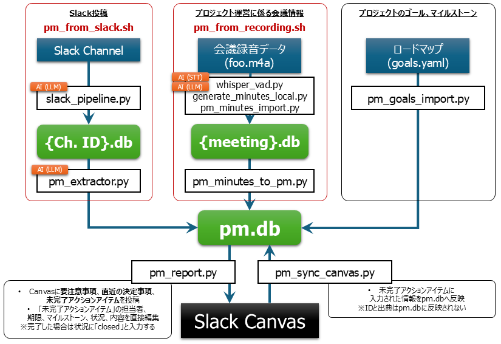

# ProjectManagement

プロジェクトマネジメント支援システム。

---

## 設計思想

### 目指すプロマネの姿

このシステムが目指すのは、**「議事録係＋ToDoリスト管理」ではなく、プロジェクトのゴールへの到達を管理するプロジェクトマネジメント**である。

一般的なAI活用PMツールは、発言・議事録・Slackから決定事項やアクションアイテムを拾い上げることに終始しがちである。それは情報の整理には役立つが、「プロジェクトが今どこにいるのか」「ゴールに向けて前進しているのか」を答えることができない。

本システムは以下の2層構造でこの問題に対処する。

```
【トップダウン層】 ゴール・マイルストーン（人間が定義・承認、goals.yamlで管理）
                          ↓ 評価の軸を与える
【ボトムアップ層】 アクションアイテム・決定事項（LLMが自動抽出・マイルストーンに紐づけ）
```

**トップダウン層**: プロジェクトのゴールと主要マイルストーンは `goals.yaml` に人手で定義し、意思決定者が承認する。LLMによる自動抽出に頼らない。gitで管理することでマイルストーン変更の意思決定履歴も残る。

**ボトムアップ層**: 会議議事録・Slackの膨大な情報からアクションアイテム・決定事項をLLMが自動抽出する。各アイテムはマイルストーンに紐づけられ、「このタスクはどのゴールに向けた作業か」が明確になる。

### LLMと人間の役割分担

| 役割 | 担当 |
|------|------|
| ゴール・マイルストーンの定義・承認 | 人間（意思決定者） |
| 情報の収集・整理・抽出 | LLM |
| アイテムのマイルストーンへの紐づけ推定 | LLM ※未実装 |
| 誤りの修正・最終判断 | 人間（Canvas上で編集） |
| 達成状況の計算・レポート生成 | システム |

LLMは「情報処理の自動化」に使い、「何を目指すか」「どこまで達成したか」の判断は人間が行う。

### 現在の実装状況

フェーズ1〜5が実装済み。`goals.yaml` にゴール・マイルストーンを定義し、`pm_goals_import.py` でDBに同期することで、レポートに「プロジェクトの現在地」セクションが自動追加される。

---

## 概要

会議議事録（Whisper文字起こし）とSlackチャンネルの投稿から、LLM（Claude）を使って決定事項とアクションアイテムを自動抽出し、SQLiteデータベース（pm.db）に蓄積する。蓄積した情報を週次進捗レポートとしてSlack Canvasに投稿し、Canvas上で対応状況を記入することでDBを更新するワークフローを提供する。

---

## 情報の流れ



---

## スクリプト構成

| スクリプト | 役割 |
|---|---|
| `slack_to_pm.sh` | Slack Channel から投稿を取得、スレッド単位で要約し pm.db へ登録 |
| `auto_recording_import.sh` | 会議録音データ(m4aフォーマット)から文字起こしを行い、議事録を作成し pm.db へ登録 |
| `recording_to_pm.sh` | 会議録音データ(m4aフォーマット)から文字起こしを実施 |
| `pm_goals_import.py` | `goals.yaml` を pm.db に完全同期（ゴール・マイルストーン管理） |
| `slack_pipeline.py` | Slackメッセージを取得・要約してCanvas投稿、`{channel_id}.db`に保存。`--skip-llm` でLLMスキップ、`--list` でスレッド一覧表示 |
| `whisper_vad.py` | 会議録音をSlurmジョブとしてWhisperで文字起こし |
| `pm_minutes_import.py` | 文字起こし議事録をLLMで解析して `data/minutes/{kind}.db` に詳細保存（担当者・期限・出典付き）。`--post-to-slack` でSlackにファイル投稿。`--delete` で削除 |
| `pm_minutes_to_pm.py` | `data/minutes/{kind}.db` の内容をLLM不使用でpm.dbに転記。`--delete` で削除 |
| `pm_extractor.py` | Slack DB内のスレッド要約からアクションアイテム・決定事項を抽出してpm.dbに保存。`--list` で抽出済みスレッド一覧表示 |
| `pm_report.py` | pm.dbから週次進捗レポートを生成してSlack Canvasに投稿。SlackリンクはクリッカブルURL形式で出力 |
| `pm_sync_canvas.py` | Canvas上の編集内容（担当者・内容・期限・マイルストーン・状況・対応状況）をpm.dbに同期 |
| `pm_relink.py` | アクションアイテムの各フィールド（担当者・期限・内容・マイルストーン・status）をCSV経由で一括編集（LLM不使用）。`note`列は参照用として出力 |
| `db_utils.py` | DB接続の一元管理・平文DBの暗号化変換（SQLCipher対応） |
| `cli_utils.py` | 共通CLIユーティリティ（argparse ヘルパー・`make_logger`）。各スクリプトから内部利用 |

---

## 日常の運用フロー

### 1. Slack Channel の投稿から情報抽出

#### 1.1. `slack_to_pm.sh` を使いChannelの投稿を取得し、要約を pm.db へ登録

```sh
bash scripts/slack_to_pm.sh -c C08SXA4M7JT
```

#### 1.2. 個別のスクリプトで実行する場合 ※通常は1.1.の手順で実施する

* Slack APIを使いChannelの投稿を取得し、要約をChannelごとのDBへ登録

```sh
source ~/.secrets/slack_tokens.sh
python3 scripts/slack_pipeline.py -c C08SXA4M7JT --db data/C08SXA4M7JT.db
```

* チャンネルごとのDBからアクションアイテムを抽出し pm.db へ登録

```sh
source ~/.secrets/slack_tokens.sh
python3 scripts/pm_extractor.py -c C08SXA4M7JT

# 抽出済みスレッドの一覧確認
python3 scripts/pm_extractor.py -c C08SXA4M7JT --list
```

### 2. 会議議事録の処理：録音を文字起こし → pm.db へ登録

#### 2.1. `auto_recording_import.sh` を使い会議録音データ(m4aフォーマット)から文字起こしを行い、議事録を作成し pm.db へ登録

```sh
# 文字起こし → 議事録DB → pm.db 転記まで自動実行
bash auto_recording_import.sh

# Slackへのファイル投稿も自動化する場合（-c でチャンネルIDを指定）
bash auto_recording_import.sh -c C08SXA4M7JT
```

注意事項:
- 録音データのフォーマットは `m4a` であること
- 録音データは `data` に配置すること
- 録音データのファイル名は `YYYY-MM-DD_{meeting-name}.m4a` の書式とし、 `YYYY-MM-DD` は会議開催日、`meeting-name` は `project.md` の「会議の種類と頻度」に書かれた名前であること
- 一連の処理は R-CCS Cloud のGPUサーバ (L40S, GH200) へバッチジョブとして投入、実行される
- `-c CHANNEL_ID` を指定した場合の Slack 投稿の挙動:
  - 未インポートファイル: 文字起こし成功後に `--post-to-slack` を自動実行
  - 議事録DBにインポート済み・Slack未投稿: GPU不要のため sbatch を介さず直接投稿
  - 議事録DBにインポート済み・Slack投稿済み: スキップ（再投稿するには手動で `--force`）
  - `~/.secrets/slack_tokens.sh` が自動的に読み込まれる

#### 2.2. 個別のスクリプトで実行する場合 ※通常は2.2.の手順で実施する

* 会議録音データ(m4aフォーマット)から文字起こしを実施

```sh
bash scripts/recording_to_pm.sh file1.m4a [file2.mp4 ...] [--meeting-name NAME]
```

注意事項:
- `--meeting-name` を指定すると文字起こし後に `pm_minutes_import.py`（議事録DB保存）→ `pm_minutes_to_pm.py`（pm.db転記）の順で自動実行し、.md ファイルを削除する（平文ファイルがディスクに残らない）。
- 推奨: 議事録DBとpm.dbの両方に保存（.md は削除）
```sh
bash scripts/recording_to_pm.sh GMT20260302-032528_Recording.mp4 --meeting-name Leader_Meeting
```
- 日付を明示する場合（省略時はファイル名のGMTタイムスタンプをJSTに自動変換）
```sh
bash scripts/recording_to_pm.sh GMT20260302-032528_Recording.mp4 --meeting-name Leader_Meeting --held-at 2026-03-10
```
- 冒頭スキップ
```sh
sbatch scripts/recording_to_pm.sh GMT20260302-032528_Recording.mp4 --skip 30 --meeting-name Leader_Meeting
```
- インポート後の確認・削除:
```sh
# 議事録DBの一覧確認
python3 scripts/pm_minutes_import.py --list --meeting-name Leader_Meeting

# 特定会議の詳細確認（決定事項・AI・議事内容・Slack投稿状況）
python3 scripts/pm_minutes_import.py --show GMT20260316-035529_Recording

# pm.dbの転記内容確認
python3 scripts/pm_minutes_to_pm.py --list --meeting-name Leader_Meeting

# 削除（両DBから個別に実行）
python3 scripts/pm_minutes_import.py --delete 2026-03-10_Leader_Meeting
python3 scripts/pm_minutes_to_pm.py --delete 2026-03-10_Leader_Meeting
```
- 議事録を Slack にアップロード:
```sh
source ~/.secrets/slack_tokens.sh

# チャンネルに直接投稿（Files タブに表示）
python3 scripts/pm_minutes_import.py \
    --post-to-slack --meeting-name Leader_Meeting --held-at 2026-03-16 -c C08SXA4M7JT

# 特定スレッドにリプライとして投稿（スレッドに集約、Files タブには表示されない）
python3 scripts/pm_minutes_import.py \
    --post-to-slack --meeting-name Leader_Meeting --held-at 2026-03-16 \
    -c C08SXA4M7JT --thread-ts 1773791072.043109
```
  - `SLACK_USER_TOKEN`（xoxp-）があればユーザーとして投稿（本人が削除可能）。未設定の場合は `SLACK_MCP_XOXB_TOKEN` を使用。
  - ファイルが削除済みの場合（録音→自動インポートフロー）は DB から議事録を再構築してアップロード。
  - 二重投稿防止あり（再投稿するには `--force`）。
- .md ファイルを後から一括登録する場合:
```sh
# 議事録DB（data/minutes/）に保存
python3 scripts/pm_minutes_import.py --bulk
python3 scripts/pm_minutes_import.py --bulk --since 2026-01-01

# pm.db に転記
python3 scripts/pm_minutes_to_pm.py
python3 scripts/pm_minutes_to_pm.py --since 2026-01-01
```

### 3. プロジェクトのゴール・マイルストーンの更新

`goals.yaml` を編集・承認したら pm.db に登録

```sh
# 変更内容の確認（DB操作なし）
python3 scripts/pm_goals_import.py --dry-run

# 同期実行（追加・更新・削除を完全同期）
python3 scripts/pm_goals_import.py

# 登録済み一覧・達成状況の確認
python3 scripts/pm_goals_import.py --list
```

### 4. Canvasで進捗を管理

#### 4.1. 会議前: 週次レポートをCanvasに投稿

```sh
source ~/.secrets/slack_tokens.sh
python3 scripts/pm_report.py --canvas-id F0ALP1XQJHL

# 確認済み決定事項も含めて表示する場合
python3 scripts/pm_report.py --canvas-id F0ALP1XQJHL --show-acknowledged
```

レポート構成:
1. プロジェクトの現在地（マイルストーン達成率・状況、DBから直接計算）
2. サマリー（LLM生成）
3. 直近の決定事項（確認済みはデフォルト非表示）
4. 要注意事項
5. 未完了アクションアイテム（表形式: ID・担当者・内容・期限・ソース・対応状況）

#### 4.2. 会議中: Canvas上でアクションアイテムの各列を編集

Canvas上で編集可能な列: **担当者・内容・期限・マイルストーン・状況・対応状況**

- **状況** 列: open/close の判定に使用。完了キーワード（`完了` `done` `済` `対応済` `解決` `close` `closed` `finish` `finished`）を入力すると `status='closed'`に更新。`open` で再開。
- **対応状況** 列: メモとして `note` 列に保存（`status` の変更には影響しない）。
- **決定事項のチェックボックス**: Canvas上の決定事項にチェックを入れると、`pm_sync_canvas.py` 実行時に「確認済み」として記録される。次回レポートからデフォルトで非表示になる。チェックを外すと確認取り消し。

#### 4.3. 会議後: Canvas上の変更内容を pm.db に反映

```sh
source ~/.secrets/slack_tokens.sh
python3 scripts/pm_sync_canvas.py --canvas-id F0AAD2494VB
```

アクションアイテムの各列の変更に加え、決定事項チェックボックスの確認状態（`acknowledged_at`）も同期される。

---

### 5. pm.db の一括編集

アクションアイテムの各フィールドをCSVを介して手動で編集する。`assignee`・`due_date`・`milestone_id`・`content`・`status` を一括変更できる。

```sh
# milestone_id が未設定のアイテムをCSVにエクスポート
python3 scripts/pm_relink.py --export

# 全件エクスポート
python3 scripts/pm_relink.py --export --all --output relink_all.csv

# 日付フィルタ付きエクスポート
python3 scripts/pm_relink.py --export --since 2026-02-01

# 変更内容を確認（DB更新なし）
python3 scripts/pm_relink.py --import relink.csv --dry-run

# DBに反映（確認プロンプトあり）
python3 scripts/pm_relink.py --import relink.csv

# アクションアイテムをターミナルに一覧表示
python3 scripts/pm_relink.py --list
python3 scripts/pm_relink.py --list --all --since 2026-02-01
```

`assignee`・`due_date`・`milestone_id` は空欄 → NULL（解除）。`content`・`status` は空欄の場合スキップ（変更なし）。

---

## データベース構成

### `{channel_id}.db` - Slackデータ

- `messages`: 親メッセージ
- `replies`: 返信メッセージ
- `summaries`: LLMによるスレッド要約

### `data/minutes/{kind}.db` - 詳細議事録データ

会議名ごとに独立したDBファイル（例: `Leader_Meeting.db`）。`pm_minutes_import.py` が生成する。

- `instances`: 会議開催記録（開催日・ファイルパス・Slack投稿日時・チャンネル・スレッドTS）
- `minutes_content`: 議事内容（Markdown形式）
- `decisions`: 決定事項（出典付き）
- `action_items`: アクションアイテム（担当者・期限付き）

### `pm.db` - PM統合データ

- `meetings`: 会議情報（開催日・種別・要約）
- `action_items`: アクションアイテム（担当者・期限・status・note・milestone_id）
- `decisions`: 決定事項
- `slack_extractions`: 抽出済みスレッド管理（差分処理用）
- `goals` / `milestones`: goals.yaml から同期したゴール・マイルストーン
- `audit_log`: action_items の変更履歴（Canvas同期・relink 実行時に記録）

変更履歴の確認:
```sh
python3 scripts/db_utils.py --audit-log
python3 scripts/db_utils.py --audit-log --source canvas_sync --limit 50
python3 scripts/db_utils.py --audit-log --id 98        # 特定アイテムの履歴
python3 scripts/db_utils.py --audit-log --output audit.txt  # ファイルにも保存
```

---

## 環境セットアップ

### Python環境

```sh
# uv仮想環境を使用
~/.venv_x86_64/bin/python3 scripts/pm_report.py ...
# または
source ~/.venv_x86_64/bin/activate
python3 scripts/pm_report.py ...
```

### 必要パッケージ

```
slack-bolt
slack-sdk
```

### Slack Bot Token の取得

以下のスクリプトの実行には Slack Bot Token（`xoxb-...`）が必要。

1. Slack API サイト（api.slack.com/apps）でアプリを作成する
2. 「OAuth & Permissions」で以下のBot Token Scopesを付与する:
   - `channels:history` - メッセージ取得
   - `channels:read` - チャンネル情報取得
   - `users:read` - ユーザー名取得
   - `files:read` - Canvas（ファイル）取得
   - `canvases:read` - Canvas内容読み取り
   - `canvases:write` - Canvas編集
3. アプリをワークスペースにインストールし、「Bot User OAuth Token」をコピーする
4. アプリを対象チャンネルに招待する（`/invite @アプリ名`）

### トークン設定（安全な方法）

```sh
mkdir -p ~/.secrets && chmod 700 ~/.secrets
cat > ~/.secrets/slack_tokens.sh << 'EOF'
export SLACK_MCP_XOXB_TOKEN="xoxp-..."   # 全スクリプト共通（xoxp- / xoxb- どちらでも可）
export SLACK_USER_TOKEN="xoxp-..."        # pm_minutes_import.py --post-to-slack 用（ユーザーとして投稿・本人が削除可能）
EOF
chmod 600 ~/.secrets/slack_tokens.sh
```

- `SLACK_MCP_XOXB_TOKEN`: 全スクリプト共通（Canvas投稿・Slack取得・ファイルアップロード）。xoxp- / xoxb- どちらでも動作する。
- `SLACK_USER_TOKEN`: `pm_minutes_import.py --post-to-slack` でファイルを**ユーザーとして**アップロードする場合に設定する（設定するとユーザー自身が投稿を削除可能）。未設定の場合は `SLACK_MCP_XOXB_TOKEN` を使用。

---

## セキュリティ

### DBの暗号化（SQLCipher AES-256）

`pm.db`（決定事項・アクションアイテム・会議情報）および `{channel_id}.db`（Slackメッセージ・要約）の全DBに SQLCipher による AES-256 暗号化を採用している。ファイルが漏洩しても鍵なしでは内容を読めない。

暗号化鍵は `~/.secrets/pm_db_key.txt`（`chmod 600`）または環境変数 `PM_DB_KEY` から読み込む。すべてのスクリプトで DB 接続を `scripts/db_utils.py` に一元管理することで、暗号化を透過的に適用している。

#### 初回セットアップ

```sh
# 鍵を生成
python3 scripts/db_utils.py --gen-key

# 既存の平文DBを暗号化DBに変換（バックアップを自動作成）
python3 scripts/db_utils.py --migrate data/pm.db data/C08SXA4M7JT.db data/C0A9KG036CS.db

# 変換内容を確認のみ（変換しない）
python3 scripts/db_utils.py --migrate data/pm.db --dry-run

# バックアップなしで変換
python3 scripts/db_utils.py --migrate data/pm.db --no-backup
```

生成した鍵はパスワードマネージャー等に必ずバックアップすること。**鍵を紛失すると暗号化済みDBは復元不可能。**

---

## 注意事項

- `claude -p` はClaude Codeセッション内からは実行不可。`pm_minutes_import.py`, `pm_extractor.py`, `pm_report.py` は**Claude Codeの外のターミナル**から実行すること。
- Slack Canvasは表示できない文字（特殊Unicode）を含むとAPIエラーになる。スクリプト内で`sanitize_for_canvas()`による除去処理を実施済み。
- pm_report.pyは上書き投稿のみ対応。初回実行前にCanvasの内容を手動で削除しておくこと。
- Slack DBはチャンネルごとに独立（`data/{channel_id}.db`）。pm.dbは複数チャンネル・複数会議を横断して統合する。
